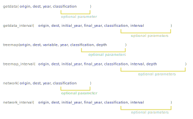

# Introduction

`oec` is an [Observatory of Economic Complexity](http://atlas.media.mit.edu/en/) API wrapper and utility program. Since v1.0 its available on [CRAN](https://cran.r-project.org/web/packages/oec/index.html).

# Data sources

All of the product data shown on the site is classified using either SITC (Standard International Trade Classification) or HS (Harmonized System).

For historical SITC classification data (1962 - 2000), we use data from [The Center for International Data from Robert Feenstra](http://cid.econ.ucdavis.edu/). For more recent data (2001 - 2016), we use data provided by [UN Comtrade](http://comtrade.un.org/).

# How to use the package?

The easiest way to use this package, and R in general, is to use [RStudio IDE](https://www.rstudio.com/) that allows users to create projects that do not depend on absolute paths.

The package is fully documented [here](examples/oec.pdf). In this vignette we provide some examples that do not replace the documentation.

## Installation

```{r install, eval = FALSE}
# 1: Install the package

# 1.1: Install from CRAN (recommended)
install.packages("oec")

# 1.2 Install from Github
#install.packages("devtools") # if needed
library(devtools)
install_github("pachamaltese/oec/r_package")
```

## Functions

The package's function can be divided between functions to import data and functions to visualize data. Visualization functions depend on data importing functions.

You can call `treemap()` or `network()` without calling data importing functions first. The package will automatically download or read the data needed to visualize.

Here is a general description of the functions:



## Basic use

```{r functions1, eval = FALSE}
# 1.1: Load the package
library(oec)

# 1.2: Copy the demo script to your project's folder.
demos()

# 1.3: Explore the countries list if you are not sure about the countries codes
countries_list
```

### Treemap functions

```{r functions2, eval = FALSE}
# 2.1: What does Chile export to China? (2016) (HS92 4 characters)
treemap("chl", "chn", "exports", 2016)
treemap("chl", "chn", "exports", 2016, 1) # equivalent to last command

# 2.2: What does Chile export to China? (2010-2016) (HS92 4 characters)
treemap_interval("chl", "chn", "exports", 2010, 2016)
treemap_interval("chl", "chn", "exports", 2010, 2016, 1, 1, 1) # equivalent to last command
```

### Network functions

```{r functions3, eval = FALSE}
# 3.1: What are the export opportunities of Chile? (2016, trade with China) (HS92 4 characters)
network("chl", "chn", 2016)
network("chl", "chn", 2016, 1) # equivalent to last command

# 3.2: What are the export opportunities of Chile? (2010-2016, trade with China) (HS92 4 characters)
network_interval("chl", "chn", 2010, 2016)
network_interval("chl", "chn", 2010, 2016, 1, 1) # equivalent to last command
```

### Getdata functions

```{r functions4, eval = FALSE}
# 4.1: Download trade between Chile and China in the year 2016 from OEC's API (HS92 4 characters)
getdata("chl", "chn", 2016)
getdata("chl", "chn", 2016, 1) # equivalent to last command

# 4.2: Download trade between Chile and China in the year 2016 from OEC's API (SITC rev2 4 characters)
getdata("chl", "chn", 2016, 2)

# 4.3: Download trade between Chile and China in the year 2016 from from OEC's API (HS92 6 characters)
getdata("chl", "chn", 2016, 3)

# 4.3: Download trade between Chile and China in the years 2010-2016 from OEC's API (HS92 4 characters)
getdata_interval("chl", "chn", 2010, 2016)
getdata_interval("chl", "chn", 2010, 2016, 1, 1) # equivalent to last command

# 4.4: Download trade between Chile and China in the years 2010, 2012 and 2014 from OEC's API (HS92 4 characters)
getdata_interval("chl", "chn", 2010, 2014, 1, 2)

# 4.5: Download trade between Chile and China in the years 2010, 2012 and 2014 from OEC's API (SITC rev2 4 characters)
getdata_interval("chl", "chn", 2010, 2014, 2, 2)

# 4.6: Download trade between Chile and China in the years 2010, 2012 and 2014 from OEC's API (HS92 6 characters)
getdata_interval("chl", "chn", 2010, 2014, 3, 2)
```
